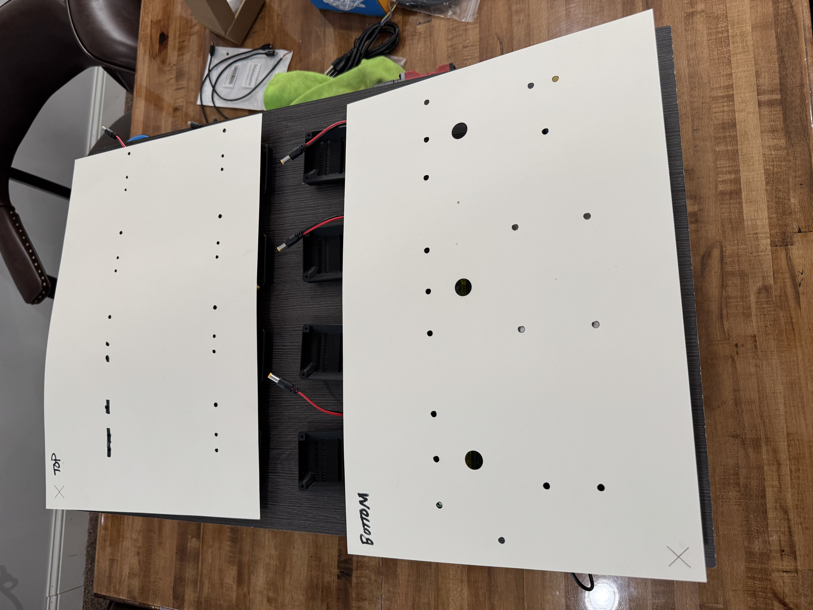

# Bitaxe x12 Wall Art
## An awesome way to have your units presented on the wall hashing away


## Parts List
1. [350 Watt 5V PSU](https://a.co/d/cKXBj2Z)
2. 2 x [Rocker Switches](https://a.co/d/2cINhTp)
3. [Pi 5](https://a.co/d/4UUITfU)
4. [Pi 5 Display](https://a.co/d/iiqE7PS)
5. [Mini Router](https://a.co/d/aRCLFQo)
6. [18 Gauge Wire](https://a.co/d/dYbQ89J)
6. [10 Gauge Wire](https://a.co/d/2jiSPPX)
7. [8mm Screws](https://a.co/d/b6NSR73)
8. You can use all of the power adapters that come with the Bitaxes and simply cut the ends to wire them to the rocker switches.  For the board display itself, I just used 24" wide shelving and cut it to the size I needed.  To hide the particle board edges, I used (2) 2"x2"x8' cedar and pin nailed it from the edges.

## 3D Parts
1. [Bitaxe Case with DIN RAIL](3D/bitaxe-case-din-rail.stl)
2. [Mini DIN Rails for the Bitaxes](3D/din-rail-bitaxe.stl)
3. [Modified DIN Rails for the Rocker Switches](3D/din-rail-power-hub.stl)
4. [Mini Router Adapter for mounting](3D/router-mount.stl)
5. [PSU adapter for mounting](3D/psu-mount.stl)

## Assembly Guide

### 1. Frame Preparation
1. Start with a 24" wide shelving board cut to your desired dimensions
2. Lay out all components to determine optimal spacing and layout
3. Create a detailed layout plan using the provided files in the "layout" directory
4. Use 18x12 paper in a laser engraver to create precise hole templates for drilling


### 2. Hole Layout and Drilling
1. Use the laser-cut templates to mark all drilling locations
2. Pre-drill holes for mounting points
3. Create openings for components and wiring
4. Verify all holes align with component placement



### 3. Component Installation
1. Mount all DIN rails according to the layout
2. Install Bitaxe cases onto the DIN rails
3. Ensure all mounting points are secure and properly aligned


### 4. Wiring Configuration
1. Use 10-gauge wire for PSU to hub connections
   - Required due to high current draw from multiple Bitaxes
   - Ensures safe power distribution
2. Route wires to corresponding rocker switch hubs
3. Secure wires along the back of the frame using staples
4. Organize wiring into three distinct groups:
   - Hub 1: Mini Router and Raspberry Pi 5
   - Hub 2: Bitaxes 1-6
   - Hub 3: Bitaxes 7-12

### 5. Frame Assembly
1. Create 3/4" x 3/4" notches using a table saw
   - Ensures frame rigidity
   - Provides flush mounting surface
   - Supports overall weight distribution
2. Drill power cable exit hole at the bottom of the frame
3. Secure all components
4. Perform final inspection of all connections


### 6. Final Steps
1. Verify all electrical connections
2. Test each Bitaxe individually
3. Ensure proper ventilation
4. Mount the completed assembly

## *** Optional ***
The guide below outlines how to set up a Raspberry Pi 5 with an MHS-3.5inch display (480x320) as a headless API gateway for remotely managing multiple Bitaxe miners, using a command-line interface instead of a full GUI.

## Table of Contents
1. [Initial Raspberry Pi Setup](#1-initial-raspberry-pi-setup)
2. [Basic Configuration](#2-basic-configuration)
3. [MHS-3.5inch Display Configuration](#3-mhs-35inch-display-configuration)
4. [API Server Setup](#4-api-server-setup)
5. [Command-Line Dashboard](#5-command-line-dashboard)
6. [Remote Access](#6-remote-access)
7. [Maintenance](#7-maintenance)

## 1. Initial Raspberry Pi Setup

### OS Installation
1. Download the Raspberry Pi Imager: https://www.raspberrypi.com/software/
2. Insert your SD card into your computer
3. Launch the Raspberry Pi Imager
4. Select "Raspberry Pi OS Lite (64-bit)" - this is a headless version without a desktop
5. Select your SD card
6. Click the gear icon for advanced options:
   - Set a hostname (e.g., `bitaxe-monitor`)
   - Enable SSH with password or key-based authentication
   - Configure Wi-Fi (if needed)
   - Set username and password
   - **IMPORTANT**: Enable "Skip first-run wizard" option
   - Configure locale settings
7. Write the image to the SD card

### Initial Boot
1. Insert the SD card into your Raspberry Pi
2. Connect the MHS-3.5inch display (but don't worry about display output yet)
3. Connect power and wait for boot
4. Find your Pi's IP address from your router
5. SSH into your Pi:
   ```bash
   ssh username@your-pi-ip-address
   ```

## 2. Basic Configuration

### Updates and Essential Packages
```bash
# Update the system
sudo apt update
sudo apt upgrade -y

# Install essential packages
sudo apt install -y git curl wget htop nodejs npm python3 python3-pip jq bc

# Install framebuffer utilities for the display
sudo apt install -y fbset fbi

# Enable the SPI interface (required for the display)
sudo raspi-config nonint do_spi 0

# Set boot options to console
sudo raspi-config nonint do_boot_behaviour B1
```

### Security Hardening
```bash
# Install firewall
sudo apt install -y ufw

# Configure basic firewall rules
sudo ufw allow 22/tcp
sudo ufw allow 3000/tcp
sudo ufw enable

# Set up fail2ban for SSH protection
sudo apt install -y fail2ban
sudo systemctl enable fail2ban
sudo systemctl start fail2ban
```

## 3. MHS-3.5inch Display Configuration

### Driver Installation
```bash
# Clone the driver repository
git clone https://github.com/goodtft/LCD-show.git

# Set permissions
chmod -R 755 LCD-show

# Navigate to driver directory
cd LCD-show/

# Install the driver with the correct rotation (adjust as needed)
sudo ./MHS35-show 90
```

The system will reboot after driver installation. After reboot, SSH back in.

### Framebuffer Display Configuration
```bash
# Create a display testing script
cat > ~/test-display.sh << 'EOF'
#!/bin/bash
# Clear the screen
clear

# Display a test message
echo -e "\e[1;36mBitaxe Monitor Display Test\e[0m"
echo -e "\e[1;33mIf you can read this, your display is working!\e[0m"
EOF

# Make it executable
chmod +x ~/test-display.sh

# Run the test
~/test-display.sh
```

## 4. API Server Setup

### Setting Up Node.js API Server
1. Create a project directory:
   ```bash
   mkdir -p ~/bitaxe-api-gateway
   cd ~/bitaxe-api-gateway
   ```

2. Initialize a Node.js project:
   ```bash
   npm init -y
   ```

3. Install necessary packages:
   ```bash
   npm install express cors helmet dotenv axios morgan winston jsonwebtoken express-rate-limit
   ```

4. Create an environment file:
   ```bash
   nano .env
   ```
   
   Add the following:
   ```
   PORT=3000
   JWT_SECRET=your_strong_jwt_secret_here
   LOG_LEVEL=info
   NODE_ENV=production
   ADMIN_USERNAME=?????
   ADMIN_PASSWORD=???????????
   ```

5. Create the main server file:

  I wanted each of my Bitaxes to have a fixed IP so I could easily access them locally based on their IP address.  The mini router should start all IPs with 192.168.8.XXX - you can login to the panel at 192.168.8.1.  Once you are logged in, you can go to the advanced settings and give each of your Bitaxes whatever IP address you want (based on its MAC Address), refresh the DHCP leases, and reboot.  It should always now have that IP address even if you move this "art" display to a new location :)

   ```bash
   nano server.js

   Add the following:
   ```
   cat > ~/bitaxe-api-gateway/server.js << 'EOL'
require('dotenv').config();
const express = require('express');
const cors = require('cors');
const helmet = require('helmet');
const morgan = require('morgan');
const winston = require('winston');
const axios = require('axios');
const fs = require('fs');
const path = require('path');
const jwt = require('jsonwebtoken');

// Configuration
const PORT = process.env.PORT || 3000;
const NODE_ENV = process.env.NODE_ENV || 'development';
const LOG_LEVEL = process.env.LOG_LEVEL || 'info';
const JWT_SECRET = process.env.JWT_SECRET || 'default_jwt_secret_replace_in_production';

// Bitaxe configurations
const BITAXES = [
  { id: 1, name: "Bitaxe-1", ip: "192.168.8.101" },
  { id: 2, name: "Bitaxe-2", ip: "192.168.8.102" },
  { id: 3, name: "Bitaxe-3", ip: "192.168.8.103" },
  { id: 4, name: "Bitaxe-4", ip: "192.168.8.104" },
  { id: 5, name: "Bitaxe-5", ip: "192.168.8.105" },
  { id: 6, name: "Bitaxe-6", ip: "192.168.8.106" },
  { id: 7, name: "Bitaxe-7", ip: "192.168.8.107" },
  { id: 8, name: "Bitaxe-8", ip: "192.168.8.108" },
  { id: 9, name: "Bitaxe-9", ip: "192.168.8.109" },
  { id: 10, name: "Bitaxe-10", ip: "192.168.8.110" },
  { id: 11, name: "Bitaxe-11", ip: "192.168.8.111" },
  { id: 12, name: "Bitaxe-12", ip: "192.168.8.112" }
];

// Admin credentials
const ADMIN_USERNAME = process.env.ADMIN_USERNAME || 'admin';
const ADMIN_PASSWORD = process.env.ADMIN_PASSWORD || 'changeme';

// Setup logger
const logger = winston.createLogger({
  level: LOG_LEVEL,
  format: winston.format.combine(
    winston.format.timestamp(),
    winston.format.json()
  ),
  defaultMeta: { service: 'bitaxe-api-gateway' },
  transports: [
    new winston.transports.File({ filename: 'logs/error.log', level: 'error' }),
    new winston.transports.File({ filename: 'logs/combined.log' }),
  ],
});

if (NODE_ENV !== 'production') {
  logger.add(new winston.transports.Console({
    format: winston.format.simple(),
  }));
}

const logsDir = path.join(__dirname, 'logs');
if (!fs.existsSync(logsDir)) {
  fs.mkdirSync(logsDir);
}

const app = express();

app.use(helmet({
  contentSecurityPolicy: {
    directives: {
      defaultSrc: ["'self'"],
      scriptSrc: ["'self'", "'unsafe-inline'"],
      styleSrc: ["'self'", "'unsafe-inline'"]
    }
  }
}));
app.use(cors());
app.use(express.json());
app.use(morgan('combined'));

const authenticateToken = (req, res, next) => {
  const authHeader = req.headers['authorization'];
  const token = authHeader && authHeader.split(' ')[1];
  
  if (!token) {
    return res.status(401).json({ message: 'Authentication token required' });
  }
  
  jwt.verify(token, JWT_SECRET, (err, user) => {
    if (err) {
      logger.warn(`Invalid token attempt: ${err.message}`);
      return res.status(403).json({ message: 'Invalid or expired token' });
    }
    
    req.user = user;
    next();
  });
};

const errorHandler = (err, req, res, next) => {
  logger.error(`${err.name}: ${err.message}`, { stack: err.stack });
  res.status(500).json({ 
    error: {
      message: NODE_ENV === 'production' 
        ? 'An unexpected error occurred' 
        : err.message
    }
  });
};

app.get('/health', (req, res) => {
  res.status(200).json({ status: 'ok', timestamp: new Date().toISOString() });
});

app.post('/api/login', (req, res) => {
  const { username, password } = req.body;
  
  if (username !== ADMIN_USERNAME || password !== ADMIN_PASSWORD) {
    logger.warn(`Failed login attempt for user: ${username}`);
    return res.status(401).json({ message: 'Invalid credentials' });
  }
  
  const token = jwt.sign({ username }, JWT_SECRET, { expiresIn: '7d' });
  
  logger.info(`User ${username} logged in successfully`);
  res.json({ 
    message: 'Login successful',
    token 
  });
});

app.get('/api/bitaxes', (req, res) => {
  res.json(BITAXES.map(({ id, name, ip }) => ({ id, name, ip })));
});

app.get('/api/bitaxes/:id/info', async (req, res, next) => {
  try {
    const bitaxe = BITAXES.find(b => b.id === parseInt(req.params.id));
    if (!bitaxe) {
      return res.status(404).json({ message: 'Bitaxe not found' });
    }
    
    const response = await axios.get(`http://${bitaxe.ip}/api/system/info`, { timeout: 3000 });
    res.json({
      bitaxe: {
        id: bitaxe.id,
        name: bitaxe.name,
        ip: bitaxe.ip
      },
      info: response.data
    });
  } catch (error) {
    if (error.code === 'ECONNREFUSED' || error.code === 'ETIMEDOUT') {
      return res.status(503).json({ 
        message: `Bitaxe ${req.params.id} is not reachable` 
      });
    }
    next(error);
  }
});

app.patch('/api/bitaxes/:id/settings', authenticateToken, async (req, res, next) => {
  try {
    const bitaxe = BITAXES.find(b => b.id === parseInt(req.params.id));
    if (!bitaxe) {
      return res.status(404).json({ message: 'Bitaxe not found' });
    }
    
    const { frequency, autofanspeed, overheat_mode } = req.body;
    const payload = {};
    
    if (frequency !== undefined) {
      if (frequency < 200 || frequency > 800) {
        return res.status(400).json({ message: 'Frequency must be between 200 and 800' });
      }
      payload.frequency = frequency;
    }
    
    if (autofanspeed !== undefined) {
      if (![0, 1].includes(autofanspeed)) {
        return res.status(400).json({ message: 'autofanspeed must be 0 or 1' });
      }
      payload.autofanspeed = autofanspeed;
    }
    
    if (overheat_mode !== undefined) {
      if (![0, 1].includes(overheat_mode)) {
        return res.status(400).json({ message: 'overheat_mode must be 0 or 1' });
      }
      payload.overheat_mode = overheat_mode;
    }
    
    await axios({
      method: 'PATCH',
      url: `http://${bitaxe.ip}/api/system`,
      headers: {
        'Content-Type': 'application/json'
      },
      data: payload,
      timeout: 3000
    });
    
    logger.info(`User ${req.user.username} updated settings for Bitaxe ${req.params.id}`);
    res.json({ 
      message: `Bitaxe ${req.params.id} settings updated successfully`,
      updatedSettings: payload
    });
  } catch (error) {
    if (error.code === 'ECONNREFUSED' || error.code === 'ETIMEDOUT') {
      return res.status(503).json({ 
        message: `Bitaxe ${req.params.id} is not reachable` 
      });
    }
    next(error);
  }
});

app.post('/api/bitaxes/:id/restart', authenticateToken, async (req, res, next) => {
  try {
    const bitaxe = BITAXES.find(b => b.id === parseInt(req.params.id));
    if (!bitaxe) {
      return res.status(404).json({ message: 'Bitaxe not found' });
    }
    
    await axios.post(`http://${bitaxe.ip}/api/system/restart`, {}, { timeout: 3000 });
    
    logger.info(`User ${req.user.username} restarted Bitaxe ${req.params.id}`);
    res.json({ 
      message: `Restart command sent to Bitaxe ${req.params.id}` 
    });
  } catch (error) {
    if (error.code === 'ECONNREFUSED' || error.code === 'ETIMEDOUT') {
      return res.status(503).json({ 
        message: `Bitaxe ${req.params.id} is not reachable` 
      });
    }
    next(error);
  }
});

app.post('/api/bitaxes/:id/reset-overheat', authenticateToken, async (req, res, next) => {
  try {
    const bitaxe = BITAXES.find(b => b.id === parseInt(req.params.id));
    if (!bitaxe) {
      return res.status(404).json({ message: 'Bitaxe not found' });
    }
    
    const infoResponse = await axios.get(`http://${bitaxe.ip}/api/system/info`, { timeout: 3000 });
    
    if (infoResponse.data.overheat_mode === 1) {
      await axios({
        method: 'PATCH',
        url: `http://${bitaxe.ip}/api/system`,
        headers: {
          'Content-Type': 'application/json'
        },
        data: {
          frequency: 525,
          autofanspeed: 1,
          overheat_mode: 0
        },
        timeout: 3000
      });
      
      await axios.post(`http://${bitaxe.ip}/api/system/restart`, {}, { timeout: 3000 });
      
      logger.info(`User ${req.user.username} reset overheat mode for Bitaxe ${req.params.id}`);
      res.json({ 
        message: `Bitaxe ${req.params.id} overheat reset and restarted` 
      });
    } else {
      res.json({ 
        message: `Bitaxe ${req.params.id} is not in overheat mode` 
      });
    }
  } catch (error) {
    if (error.code === 'ECONNREFUSED' || error.code === 'ETIMEDOUT') {
      return res.status(503).json({ 
        message: `Bitaxe ${req.params.id} is not reachable` 
      });
    }
    next(error);
  }
});

app.post('/api/bitaxes/batch/reset-overheat', authenticateToken, async (req, res) => {
  const results = [];
  
  logger.info(`User ${req.user.username} initiated batch reset of overheated bitaxes`);
  
  for (const bitaxe of BITAXES) {
    try {
      const infoResponse = await axios.get(`http://${bitaxe.ip}/api/system/info`, { timeout: 3000 });
      
      if (infoResponse.data.overheat_mode === 1) {
        await axios({
          method: 'PATCH',
          url: `http://${bitaxe.ip}/api/system`,
          headers: {
            'Content-Type': 'application/json'
          },
          data: {
            frequency: 525,
            autofanspeed: 1,
            overheat_mode: 0
          },
          timeout: 3000
        });
        
        await axios.post(`http://${bitaxe.ip}/api/system/restart`, {}, { timeout: 3000 });
        
        results.push({
          id: bitaxe.id,
          name: bitaxe.name,
          status: 'reset',
          message: 'Overheat reset and restarted'
        });
      } else {
        results.push({
          id: bitaxe.id,
          name: bitaxe.name,
          status: 'skipped',
          message: 'Not in overheat mode'
        });
      }
    } catch (error) {
      results.push({
        id: bitaxe.id,
        name: bitaxe.name,
        status: 'error',
        message: error.code === 'ECONNREFUSED' || error.code === 'ETIMEDOUT' 
          ? 'Not reachable' 
          : error.message
      });
    }
  }
  
  res.json({
    message: 'Batch operation completed',
    results
  });
});

app.get('/api/monitor', async (req, res) => {
  const results = [];
  
  for (const bitaxe of BITAXES) {
    try {
      const response = await axios.get(`http://${bitaxe.ip}/api/system/info`, { timeout: 3000 });
      
      results.push({
        id: bitaxe.id,
        name: bitaxe.name,
        status: 'online',
        hashRate: response.data.hashRate,
        temperature: response.data.temp,
        frequency: response.data.frequency,
        overheat_mode: response.data.overheat_mode,
        sharesAccepted: response.data.sharesAccepted,
        sharesRejected: response.data.sharesRejected,
        uptimeSeconds: response.data.uptimeSeconds
      });
    } catch (error) {
      results.push({
        id: bitaxe.id,
        name: bitaxe.name,
        status: 'offline',
        error: error.code || 'Unknown error'
      });
    }
  }
  
  res.json({
    timestamp: new Date().toISOString(),
    bitaxes: results
  });
});

app.get('/login', (req, res) => {
  res.send(`
    <!DOCTYPE html>
    <html lang="en">
    <head>
      <meta charset="UTF-8">
      <meta name="viewport" content="width=device-width, initial-scale=1.0">
      <title>Bitaxe Monitor Login</title>
      <style>
        * {
          box-sizing: border-box;
        }
        
        body {
          font-family: 'Segoe UI', -apple-system, BlinkMacSystemFont, sans-serif;
          margin: 0;
          padding: 0;
          background-color: #121212;
          color: #ecf0f1;
          display: flex;
          justify-content: center;
          align-items: center;
          height: 100vh;
        }
        
        .login-container {
          background-color: #222;
          padding: 24px;
          border-radius: 8px;
          width: 320px;
          box-shadow: 0 4px 6px rgba(0, 0, 0, 0.1);
        }
        
        .form-group {
          margin-bottom: 16px;
        }
        
        label {
          display: block;
          margin-bottom: 6px;
          font-size: 14px;
          color: #95a5a6;
        }
        
        input {
          width: 100%;
          padding: 10px 12px;
          border: 1px solid #444;
          background-color: #333;
          color: #ecf0f1;
          border-radius: 4px;
          font-size: 14px;
          transition: border-color 0.3s;
        }
        
        input:focus {
          outline: none;
          border-color: #3498db;
        }
        
        button {
          background-color: #3498db;
          color: white;
          border: none;
          padding: 12px;
          border-radius: 4px;
          cursor: pointer;
          width: 100%;
          font-size: 14px;
          font-weight: 600;
          transition: background-color 0.3s;
        }
        
        button:hover {
          background-color: #2980b9;
        }
        
        .error {
          color: #e74c3c;
          margin-top: 12px;
          text-align: center;
          font-size: 14px;
        }
        
        h2 {
          text-align: center;
          margin-top: 0;
          margin-bottom: 24px;
          font-size: 24px;
          font-weight: 600;
        }
      </style>
    </head>
    <body>
      <div class="login-container">
        <h2>Bitaxe Monitor</h2>
        <form id="loginForm">
          <div class="form-group">
            <label for="username">Username</label>
            <input type="text" id="username" name="username" required>
          </div>
          <div class="form-group">
            <label for="password">Password</label>
            <input type="password" id="password" name="password" required>
          </div>
          <button type="submit">Login</button>
          <div id="error" class="error"></div>
        </form>
      </div>
      
      <script>
        document.getElementById('loginForm').addEventListener('submit', async (e) => {
          e.preventDefault();
          
          const username = document.getElementById('username').value;
          const password = document.getElementById('password').value;
          const errorElement = document.getElementById('error');
          
          try {
            const response = await fetch('/api/login', {
              method: 'POST',
              headers: {
                'Content-Type': 'application/json'
              },
              body: JSON.stringify({ username, password })
            });
            
            const data = await response.json();
            
            if (!response.ok) {
              throw new Error(data.message || 'Login failed');
            }
            
            localStorage.setItem('authToken', data.token);
            window.location.href = '/display';
          } catch (error) {
            errorElement.textContent = error.message;
          }
        });
      </script>
    </body>
    </html>
  `);
});

// Endpoint to get Shelly power data
app.get('/api/shelly', async (req, res) => {
  try {
    const response = await axios.post('http://192.168.8.121/rpc', {
      id: 1,
      method: 'PM1.GetStatus',
      params: { id: 0 }
    }, {
      headers: {
        'Content-Type': 'application/json'
      }
    });

    // Return the power data
    res.json(response.data.result);
  } catch (error) {
    console.error('Error fetching Shelly data:', error);
    res.status(500).json({ error: 'Failed to fetch Shelly data' });
  }
});

app.get('/display', (req, res) => {
  res.send(`
    <!DOCTYPE html>
    <html lang="en">
    <head>
      <meta charset="UTF-8">
      <meta name="viewport" content="width=device-width, initial-scale=1.0">
      <title>Bitaxe Monitor</title>
      <link rel="stylesheet" href="https://cdnjs.cloudflare.com/ajax/libs/font-awesome/6.4.0/css/all.min.css">
      <style>
        :root {
          --primary: #3498db;
          --primary-dark: #2980b9;
          --secondary: #2ecc71;
          --danger: #e74c3c;
          --warning: #f39c12;
          --dark: #1a1a1a;
          --darker: #121212;
          --card: #222222;
          --text: #ecf0f1;
          --text-secondary: #95a5a6;
          --border-radius: 8px;
          --spacing: 16px;
          --transition: all 0.3s ease;
        }
        
        * {
          margin: 0;
          padding: 0;
          box-sizing: border-box;
        }
        
        body {
          font-family: 'Segoe UI', -apple-system, BlinkMacSystemFont, sans-serif;
          background-color: var(--darker);
          color: var(--text);
          line-height: 1.6;
        }
        
        .container {
          max-width: 1400px;
          margin: 0 auto;
          padding: var(--spacing);
        }
        
        .header {
          display: flex;
          justify-content: space-between;
          align-items: center;
          padding: var(--spacing);
          background-color: var(--dark);
          border-radius: var(--border-radius);
          margin-bottom: var(--spacing);
          box-shadow: 0 4px 6px rgba(0, 0, 0, 0.1);
        }
        
        .header-content {
          display: flex;
          align-items: center;
        }
        
        .header-content h1 {
          margin: 0;
          font-size: 1.8rem;
          font-weight: 600;
        }
        
        .header-logo {
          margin-right: 12px;
          color: var(--primary);
          font-size: 1.8rem;
        }
        
        .updated-info {
          font-size: 0.8rem;
          color: var(--text-secondary);
          margin-left: 16px;
        }
        
        .stats-grid {
          display: grid;
          grid-template-columns: repeat(auto-fit, minmax(200px, 1fr));
          gap: var(--spacing);
          margin-bottom: var(--spacing);
        }
        
        .stat-card {
          background-color: var(--card);
          border-radius: var(--border-radius);
          padding: var(--spacing);
          box-shadow: 0 4px 6px rgba(0, 0, 0, 0.1);
          transition: var(--transition);
          position: relative;
          overflow: hidden;
        }
        
        .stat-card:hover {
          transform: translateY(-2px);
          box-shadow: 0 6px 10px rgba(0, 0, 0, 0.2);
        }
        
        .stat-card-icon {
          position: absolute;
          top: 10px;
          right: 10px;
          font-size: 1.4rem;
          color: rgba(255, 255, 255, 0.1);
        }
        
        .stat-label {
          font-size: 0.9rem;
          color: var(--text-secondary);
          margin-bottom: 5px;
        }
        
        .stat-value {
          font-size: 1.8rem;
          font-weight: 600;
        }
        
        .stat-online { color: var(--secondary); }
        .stat-hashrate { color: var(--primary); }
        .stat-temp { color: var(--text); }
        .stat-overheat { color: var(--danger); }
        .stat-power { color: #9b59b6; }
        
        .power-grid {
          display: grid;
          grid-template-columns: repeat(3, 1fr);
          gap: var(--spacing);
          margin-bottom: var(--spacing);
        }
        
        .power-card {
          background-color: var(--card);
          border-radius: var(--border-radius);
          padding: var(--spacing);
          box-shadow: 0 2px 4px rgba(0, 0, 0, 0.1);
          transition: var(--transition);
        }
        
        .power-card:hover {
          transform: translateY(-2px);
          box-shadow: 0 6px 10px rgba(0, 0, 0, 0.2);
        }
        
        .power-header {
          font-weight: 600;
          margin-bottom: 12px;
          display: flex;
          align-items: center;
        }
        
        .power-header i {
          margin-right: 8px;
          color: #9b59b6;
        }
        
        .power-stats {
          display: grid;
          grid-template-columns: 1fr 1fr;
          gap: 8px;
          margin-bottom: 16px;
        }
        
        .power-stat {
          padding: 8px;
          background-color: rgba(0, 0, 0, 0.2);
          border-radius: 4px;
        }
        
        .power-stat-label {
          font-size: 0.7rem;
          color: var(--text-secondary);
          display: block;
        }
        
        .power-stat-value {
          font-size: 0.95rem;
          font-weight: 500;
        }
        
        /* Rest of your existing CSS */
        .bitaxe-grid {
          display: grid;
          grid-template-columns: repeat(4, 1fr);
          gap: var(--spacing);
          margin-bottom: var(--spacing);
        }
        
        .bitaxe-card {
          background-color: var(--card);
          border-radius: var(--border-radius);
          padding: var(--spacing);
          box-shadow: 0 2px 4px rgba(0, 0, 0, 0.1);
          transition: var(--transition);
        }
        
        .bitaxe-card:hover {
          transform: translateY(-2px);
          box-shadow: 0 6px 10px rgba(0, 0, 0, 0.2);
        }
        
        .bitaxe-header {
          display: flex;
          justify-content: space-between;
          align-items: center;
          margin-bottom: 12px;
        }
        
        .bitaxe-name {
          font-weight: 600;
          font-size: 1.1rem;
        }
        
        .status-indicator {
          display: flex;
          align-items: center;
        }
        
        .status-dot {
          width: 10px;
          height: 10px;
          border-radius: 50%;
          background-color: #e74c3c;
          margin-right: 6px;
        }
        
        .status-dot.online {
          background-color: var(--secondary);
        }
        
        .status-text {
          font-size: 0.8rem;
          color: var(--text-secondary);
        }
        
        .bitaxe-stats {
          display: grid;
          grid-template-columns: 1fr 1fr;
          gap: 8px;
          margin-bottom: 16px;
        }
        
        .bitaxe-stat {
          padding: 8px;
          background-color: rgba(0, 0, 0, 0.2);
          border-radius: 4px;
        }
        
        .bitaxe-stat-label {
          font-size: 0.7rem;
          color: var(--text-secondary);
          display: block;
        }
        
        .bitaxe-stat-value {
          font-size: 0.95rem;
          font-weight: 500;
        }
        
        .temp-normal { color: var(--text); }
        .temp-warning { color: var(--warning); }
        .temp-danger { color: var(--danger); }
        
        .bitaxe-actions {
          display: flex;
          gap: 8px;
        }
        
        /* Support both button styles for compatibility */
        .button, .btn {
          border: none;
          border-radius: 4px;
          padding: 6px 12px;
          font-size: 0.85rem;
          cursor: pointer;
          transition: var(--transition);
          display: flex;
          align-items: center;
          justify-content: center;
          flex: 1;
        }
        
        .button i, .btn i {
          margin-right: 4px;
        }
        
        .button, .btn-primary {
          background-color: var(--primary);
          color: white;
        }
        
        .button:hover, .btn-primary:hover {
          background-color: var(--primary-dark);
        }
        
        .button.danger, .btn-danger {
          background-color: var(--danger);
          color: white;
        }
        
        .button.danger:hover, .btn-danger:hover {
          background-color: #c0392b;
        }
        
        .controls-panel {
          margin-top: var(--spacing);
          background-color: var(--card);
          border-radius: var(--border-radius);
          padding: var(--spacing);
          box-shadow: 0 4px 6px rgba(0, 0, 0, 0.1);
        }
        
        .controls-header {
          font-weight: 600;
          margin-bottom: 12px;
          display: flex;
          align-items: center;
        }
        
        .controls-header i {
          margin-right: 8px;
          color: var(--primary);
        }
        
        .logout-button {
          background-color: transparent;
          border: 1px solid rgba(255, 255, 255, 0.2);
          color: var(--text);
          padding: 6px 12px;
          border-radius: 4px;
          cursor: pointer;
          transition: var(--transition);
          display: flex;
          align-items: center;
        }
        
        .logout-button i {
          margin-right: 6px;
        }
        
        .logout-button:hover {
          background-color: rgba(255, 255, 255, 0.1);
        }
        
        .hidden {
          display: none;
        }
        
        /* Pulse animation for online status */
        @keyframes pulse {
          0% { opacity: 0.6; }
          50% { opacity: 1; }
          100% { opacity: 0.6; }
        }
        
        .status-dot.online {
          animation: pulse 2s infinite;
        }
        
        /* Responsive adjustments */
        @media (max-width: 768px) {
          .header-content {
            flex-direction: column;
            align-items: flex-start;
          }
          
          .updated-info {
            margin-left: 0;
            margin-top: 4px;
          }
          
          .bitaxe-grid {
            grid-template-columns: repeat(2, 1fr);
          }
          
          .power-grid {
            grid-template-columns: repeat(2, 1fr);
          }
        }
        
        @media (max-width: 480px) {
          .bitaxe-grid, .power-grid {
            grid-template-columns: 1fr;
          }
        }
      </style>
    </head>
    <body>
      <div class="container">
        <div class="header">
          <div class="header-content">
            <i class="fa-solid fa-microchip header-logo"></i>
            <h1>Bitaxe Monitor</h1>
            <span id="last-updated" class="updated-info">Last updated: Never</span>
          </div>
          <button id="logout-button" class="logout-button hidden">
            <i class="fa-solid fa-sign-out-alt"></i>
            Logout
          </button>
        </div>
        
        <div class="stats-grid">
          <div class="stat-card">
            <div class="stat-card-icon">
              <i class="fa-solid fa-power-off"></i>
            </div>
            <div class="stat-label">Online</div>
            <div id="online-count" class="stat-value stat-online">0/12</div>
          </div>
          
          <div class="stat-card">
            <div class="stat-card-icon">
              <i class="fa-solid fa-bolt"></i>
            </div>
            <div class="stat-label">Total Hashrate</div>
            <div id="hashrate" class="stat-value stat-hashrate">0 GH/s</div>
          </div>
          
          <div class="stat-card">
            <div class="stat-card-icon">
              <i class="fa-solid fa-temperature-high"></i>
            </div>
            <div class="stat-label">Average Temperature</div>
            <div id="avg-temp" class="stat-value stat-temp">0°C</div>
          </div>
          
          <div class="stat-card">
            <div class="stat-card-icon">
              <i class="fa-solid fa-fire"></i>
            </div>
            <div class="stat-label">Overheated</div>
            <div id="overheat-count" class="stat-value stat-overheat">0</div>
          </div>
          
          <div class="stat-card">
            <div class="stat-card-icon">
              <i class="fa-solid fa-plug"></i>
            </div>
            <div class="stat-label">Current Power</div>
            <div id="current-power" class="stat-value stat-power">0 W</div>
          </div>
        </div>
        
        <!-- Power Monitoring Section -->
        <div class="power-grid">
          <div class="power-card">
            <div class="power-header">
              <i class="fa-solid fa-bolt"></i>
              Power Consumption
            </div>
            <div class="power-stats">
              <div class="power-stat">
                <span class="power-stat-label">Active Power</span>
                <span id="active-power" class="power-stat-value">0 W</span>
              </div>
              <div class="power-stat">
                <span class="power-stat-label">Voltage</span>
                <span id="voltage" class="power-stat-value">0 V</span>
              </div>
              <div class="power-stat">
                <span class="power-stat-label">Current</span>
                <span id="current" class="power-stat-value">0 A</span>
              </div>
              <div class="power-stat">
                <span class="power-stat-label">Frequency</span>
                <span id="frequency" class="power-stat-value">0 Hz</span>
              </div>
            </div>
          </div>
          
          <div class="power-card">
            <div class="power-header">
              <i class="fa-solid fa-chart-line"></i>
              Energy Consumption
            </div>
            <div class="power-stats">
              <div class="power-stat">
                <span class="power-stat-label">Total Energy</span>
                <span id="total-energy" class="power-stat-value">0 Wh</span>
              </div>
              <div class="power-stat">
                <span class="power-stat-label">Last Minute</span>
                <span id="last-minute-energy" class="power-stat-value">0 mWh</span>
              </div>
              <div class="power-stat">
                <span class="power-stat-label">2 Minutes Ago</span>
                <span id="two-minute-energy" class="power-stat-value">0 mWh</span>
              </div>
              <div class="power-stat">
                <span class="power-stat-label">3 Minutes Ago</span>
                <span id="three-minute-energy" class="power-stat-value">0 mWh</span>
              </div>
            </div>
          </div>
          
          <div class="power-card">
            <div class="power-header">
              <i class="fa-solid fa-calculator"></i>
              Power Metrics
            </div>
            <div class="power-stats">
              <div class="power-stat">
                <span class="power-stat-label">Hourly Consumption</span>
                <span id="hourly-consumption" class="power-stat-value">0 Wh</span>
              </div>
              <div class="power-stat">
                <span class="power-stat-label">Daily Estimate</span>
                <span id="daily-estimate" class="power-stat-value">0 kWh</span>
              </div>
              <div class="power-stat">
                <span class="power-stat-label">Monthly Estimate</span>
                <span id="monthly-estimate" class="power-stat-value">0 kWh</span>
              </div>
              <div class="power-stat">
                <span class="power-stat-label">Power Factor</span>
                <span id="power-factor" class="power-stat-value">0</span>
              </div>
            </div>
          </div>
        </div>

        <div id="bitaxe-grid" class="bitaxe-grid">
          <!-- Bitaxe cards will be added here by JavaScript -->
        </div>
        
        <div id="admin-controls" class="controls-panel hidden">
          <div class="controls-header">
            <i class="fa-solid fa-shield-alt"></i>
            Admin Controls
          </div>
          <button id="reset-all-overheat" class="button danger">
            <i class="fa-solid fa-fire-extinguisher"></i>
            Reset All Overheated
          </button>
        </div>
      </div>
      
      <script>
        // Configuration
        const REFRESH_INTERVAL = 30000; // 30 seconds
        const POWER_REFRESH_INTERVAL = 5000; // 5 seconds for power data
        let authToken = localStorage.getItem('authToken');
        let isAuthenticated = !!authToken;
        
        // Update UI based on authentication
        function updateAuthUI() {
          const adminControls = document.getElementById('admin-controls');
          const logoutButton = document.getElementById('logout-button');
          
          if (isAuthenticated) {
            adminControls.classList.remove('hidden');
            logoutButton.classList.remove('hidden');
          } else {
            adminControls.classList.add('hidden');
            logoutButton.classList.add('hidden');
          }
        }
        
        // Helper functions
        function formatHashRate(hashRate) {
          return hashRate ? hashRate.toFixed(2) + ' GH/s' : '0 GH/s';
        }
        
        function formatTemperature(temp) {
          return temp ? temp.toFixed(1) + '°C' : '-';
        }
        
        function getTemperatureClass(temp) {
          if (!temp) return 'temp-normal';
          if (temp >= 80) return 'temp-danger';
          if (temp >= 65) return 'temp-warning';
          return 'temp-normal';
        }

        function formatPower(power) {
          if (!power) return '0 W';
          if (power >= 1000) {
            return (power / 1000).toFixed(2) + ' kW';
          }
          return power.toFixed(1) + ' W';
        }

        function formatEnergy(energy, unit = 'Wh') {
          if (!energy) return '0 ' + unit;
          if (energy >= 1000 && unit === 'Wh') {
            return (energy / 1000).toFixed(2) + ' kWh';
          }
          return energy.toFixed(3) + ' ' + unit;
        }
        
        // Handle button clicks
        function setupButtonListeners() {
          // Attach event listeners to dynamically created buttons
          const bitaxeGrid = document.getElementById('bitaxe-grid');
          bitaxeGrid.addEventListener('click', (event) => {
            // Check if clicked element is a button with specific data attribute
            let target = event.target;
            
            // Handle clicks on icon inside button
            if (target.tagName === 'I' && target.parentElement.tagName === 'BUTTON') {
              target = target.parentElement;
            }
            
            if (target.tagName === 'BUTTON') {
              if (target.dataset.action === 'restart') {
                const bitaxeId = parseInt(target.dataset.id);
                restartBitaxe(bitaxeId);
              } else if (target.dataset.action === 'reset-overheat') {
                const bitaxeId = parseInt(target.dataset.id);
                resetOverheat(bitaxeId);
              }
            }
          });
          
          // Set up logout button
          document.getElementById('logout-button').addEventListener('click', () => {
            localStorage.removeItem('authToken');
            authToken = null;
            isAuthenticated = false;
            updateAuthUI();
            alert('Logged out successfully');
          });
          
          // Set up reset all overheated button
          document.getElementById('reset-all-overheat').addEventListener('click', resetAllOverheat);
        }
        
        // Update UI
        function updateUI(data) {
          const bitaxes = data.bitaxes || [];
          const bitaxeGrid = document.getElementById('bitaxe-grid');
          bitaxeGrid.innerHTML = '';
          
          // Calculate statistics
          const onlineBitaxes = bitaxes.filter(b => b.status === 'online');
          const onlineCount = onlineBitaxes.length;
          const totalHashrate = onlineBitaxes.reduce((sum, b) => sum + (b.hashRate || 0), 0);
          const temperatures = onlineBitaxes.map(b => b.temperature).filter(t => t);
          const avgTemp = temperatures.length 
            ? temperatures.reduce((sum, t) => sum + t, 0) / temperatures.length 
            : 0;
          const overheatedCount = onlineBitaxes.filter(b => b.overheat_mode === 1).length;
          
          // Update stats
          document.getElementById('online-count').textContent = onlineCount + '/' + 12;
          document.getElementById('hashrate').textContent = formatHashRate(totalHashrate);
          document.getElementById('avg-temp').textContent = formatTemperature(avgTemp);
          document.getElementById('avg-temp').className = 'stat-value stat-temp ' + getTemperatureClass(avgTemp);
          document.getElementById('overheat-count').textContent = overheatedCount;
          document.getElementById('last-updated').textContent = 'Last updated: ' + new Date().toLocaleTimeString();
          
          // Create Bitaxe cards
          bitaxes.forEach(bitaxe => {
            const card = document.createElement('div');
            card.className = 'bitaxe-card';
            
            const statusClass = bitaxe.status === 'online' ? 'online' : '';
            const tempClass = getTemperatureClass(bitaxe.temperature);
            
            const uptimeHours = bitaxe.uptimeSeconds ? Math.floor(bitaxe.uptimeSeconds / 3600) : 0;
            const uptimeMinutes = bitaxe.uptimeSeconds ? Math.floor((bitaxe.uptimeSeconds % 3600) / 60) : 0;
            const uptimeFormatted = \`\${uptimeHours}h \${uptimeMinutes}m\`;
            
            let cardContent = \`
              <div class="bitaxe-header">
                <span class="bitaxe-name">\${bitaxe.name}</span>
                <div class="status-indicator">
                  <div class="status-dot \${statusClass}"></div>
                  <span class="status-text">\${bitaxe.status === 'online' ? 'Online' : 'Offline'}</span>
                </div>
              </div>
              <div class="bitaxe-stats">
                <div class="bitaxe-stat">
                  <span class="bitaxe-stat-label">Temperature</span>
                  <span class="bitaxe-stat-value \${tempClass}">\${formatTemperature(bitaxe.temperature)}</span>
                </div>
                <div class="bitaxe-stat">
                  <span class="bitaxe-stat-label">Hashrate</span>
                  <span class="bitaxe-stat-value">\${formatHashRate(bitaxe.hashRate)}</span>
                </div>
                <div class="bitaxe-stat">
                  <span class="bitaxe-stat-label">Frequency</span>
                  <span class="bitaxe-stat-value">\${bitaxe.frequency || '-'} MHz</span>
                </div>
                <div class="bitaxe-stat">
                  <span class="bitaxe-stat-label">Uptime</span>
                  <span class="bitaxe-stat-value">\${uptimeFormatted}</span>
                </div>
              </div>\`;
            
            // Add control buttons if authenticated - using data attributes instead of inline handlers
            if (isAuthenticated && bitaxe.status === 'online') {
              cardContent += \`<div class="bitaxe-actions">
                <button class="button" data-action="restart" data-id="\${bitaxe.id}">
                  <i class="fa-solid fa-rotate"></i> Restart
                </button>\`;
              
              if (bitaxe.overheat_mode === 1) {
                cardContent += \`
                  <button class="button danger" data-action="reset-overheat" data-id="\${bitaxe.id}">
                    <i class="fa-solid fa-fire-extinguisher"></i> Reset
                  </button>\`;
              }
              
              cardContent += \`</div>\`;
            }
            
            card.innerHTML = cardContent;
            bitaxeGrid.appendChild(card);
          });
        }

        // Fetch Shelly power data
        async function fetchPowerData() {
          try {
            const response = await fetch('/api/shelly');
            const data = await response.json();
            updatePowerUI(data);
          } catch (error) {
            console.error('Error fetching power data:', error);
          }
        }

        // Update Power UI
        function updatePowerUI(data) {
          // Update main power card
          document.getElementById('current-power').textContent = formatPower(data.apower);

          // Update power metrics
          document.getElementById('active-power').textContent = formatPower(data.apower);
          document.getElementById('voltage').textContent = data.voltage.toFixed(1) + ' V';
          document.getElementById('current').textContent = data.current.toFixed(3) + ' A';
          document.getElementById('frequency').textContent = data.freq.toFixed(1) + ' Hz';

          // Update energy consumption
          document.getElementById('total-energy').textContent = formatEnergy(data.aenergy.total);
          document.getElementById('last-minute-energy').textContent = data.aenergy.by_minute[0].toFixed(1) + ' mWh';
          document.getElementById('two-minute-energy').textContent = data.aenergy.by_minute[1].toFixed(1) + ' mWh';
          document.getElementById('three-minute-energy').textContent = data.aenergy.by_minute[2].toFixed(1) + ' mWh';

          // Calculate estimated consumptions
          const hourlyConsumption = data.apower / 1000; // kW
          const dailyEstimate = hourlyConsumption * 24;
          const monthlyEstimate = dailyEstimate * 30;
          const powerFactor = data.apower > 0 ? (data.apower / (data.voltage * data.current)).toFixed(2) : '0';

          document.getElementById('hourly-consumption').textContent = formatEnergy(data.apower);
          document.getElementById('daily-estimate').textContent = formatEnergy(hourlyConsumption * 24 * 1000);
          document.getElementById('monthly-estimate').textContent = formatEnergy(hourlyConsumption * 24 * 30 * 1000);
          document.getElementById('power-factor').textContent = powerFactor;
        }
        
        // Fetch data
        async function fetchData() {
          try {
            const response = await fetch('/api/monitor');
            const data = await response.json();
            updateUI(data);
          } catch (error) {
            console.error('Error fetching data:', error);
          }
        }
        
        // API functions - with authentication
        async function restartBitaxe(id) {
          if (!authToken) {
            alert('You must be logged in to perform this action');
            return;
          }
          
          try {
            const response = await fetch('/api/bitaxes/' + id + '/restart', {
              method: 'POST',
              headers: {
                'Authorization': 'Bearer ' + authToken,
                'Content-Type': 'application/json'
              }
            });
            
            if (!response.ok) {
              const error = await response.json();
              if (response.status === 401 || response.status === 403) {
                isAuthenticated = false;
                localStorage.removeItem('authToken');
                updateAuthUI();
                alert('Authentication failed. Please log in again.');
                return;
              }
              throw new Error(error.message || 'Failed to restart bitaxe');
            }
            
            alert('Bitaxe ' + id + ' restart command sent successfully');
            setTimeout(fetchData, 5000);
          } catch (error) {
            alert('Error: ' + error.message);
          }
        }
        
        async function resetOverheat(id) {
          if (!authToken) {
            alert('You must be logged in to perform this action');
            return;
          }
          
          try {
            const response = await fetch('/api/bitaxes/' + id + '/reset-overheat', {
              method: 'POST',
              headers: {
                'Authorization': 'Bearer ' + authToken,
                'Content-Type': 'application/json'
              }
            });
            
            if (!response.ok) {
              const error = await response.json();
              if (response.status === 401 || response.status === 403) {
                isAuthenticated = false;
                localStorage.removeItem('authToken');
                updateAuthUI();
                alert('Authentication failed. Please log in again.');
                return;
              }
              throw new Error(error.message || 'Failed to reset overheat');
            }
            
            alert('Bitaxe ' + id + ' overheat reset successfully');
            setTimeout(fetchData, 5000);
          } catch (error) {
            alert('Error: ' + error.message);
          }
        }
        
        async function resetAllOverheat() {
          if (!authToken) {
            alert('You must be logged in to perform this action');
            return;
          }
          
          try {
            const response = await fetch('/api/bitaxes/batch/reset-overheat', {
              method: 'POST',
              headers: {
                'Authorization': 'Bearer ' + authToken,
                'Content-Type': 'application/json'
              }
            });
            
            if (!response.ok) {
              const error = await response.json();
              if (response.status === 401 || response.status === 403) {
                isAuthenticated = false;
                localStorage.removeItem('authToken');
                updateAuthUI();
                alert('Authentication failed. Please log in again.');
                return;
              }
              throw new Error(error.message || 'Failed to reset overheated bitaxes');
            }
            
            alert('All overheated Bitaxes have been reset');
            setTimeout(fetchData, 5000);
          } catch (error) {
            alert('Error: ' + error.message);
          }
        }
        
        // Initialize
        // Set up event listeners
        setupButtonListeners();
        
        // Initial setup
        updateAuthUI();
        
        // Initial data load
        fetchData();
        fetchPowerData();
        
        // Set up refresh intervals
        setInterval(fetchData, REFRESH_INTERVAL);
        setInterval(fetchPowerData, POWER_REFRESH_INTERVAL);
      </script>
    </body>
    </html>
  `);
});

// Add error handler middleware
app.use(errorHandler);

// Start the server
app.listen(PORT, () => {
  logger.info(`Bitaxe API Gateway started on port ${PORT}`);
  console.log(`Bitaxe API Gateway started on port ${PORT}`);
});